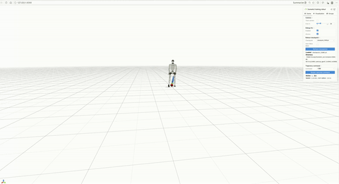
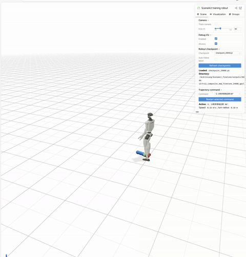
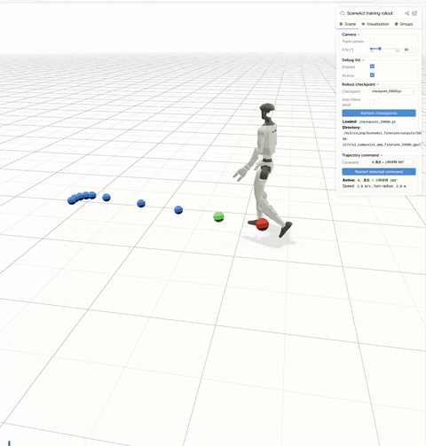
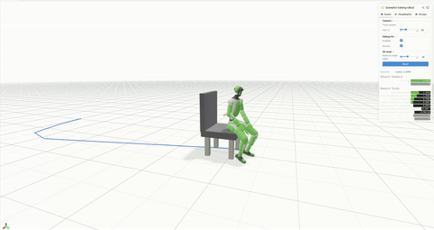
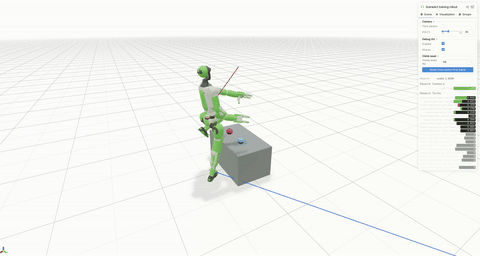
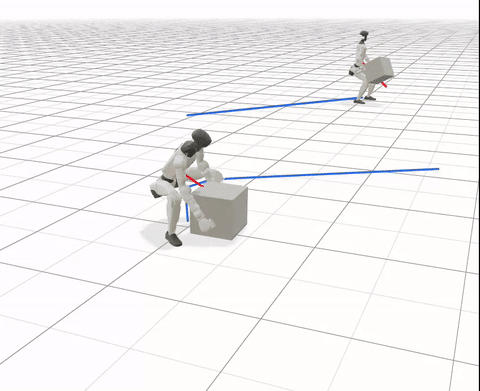
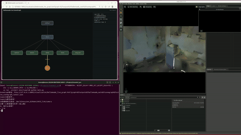

# TokenHSI g1 version Skill Demonstrations

This project is adapted from [TokenHSI](https://github.com/liangpan99/TokenHSI).

## Trajectory Skills（AMP）

The traj ckpt support a compelte walking strategy as follows:

<table>
  <tr>
    <td align="center"><strong>Traj</strong></td>
    <td align="center"><strong>In-place Turning</strong></td>
    <td align="center"><strong>Walk-Stop-Walk</strong></td>
  </tr>
  <tr>
    <td>
      
    </td>
    <td>
      
    </td>
    <td>
      
    </td>
  </tr>
</table>

## Other three Skills（AMP）

<table>
  <tr>
    <td align="center"><strong>Sit</strong></td>
    <td align="center"><strong>Climb</strong></td>
    <td align="center"><strong>Carry</strong></td>
  </tr>
  <tr>
    <td>
      
    </td>
    <td>
      
    </td>
    <td>
      
    </td>
  </tr>
</table>

## Whole Pipeline
Connect to qwen-3-vl-flash,put g1 in Gibson scene dataset

Give the command in terminal:"find the bridge and navigate in front of it."

  

